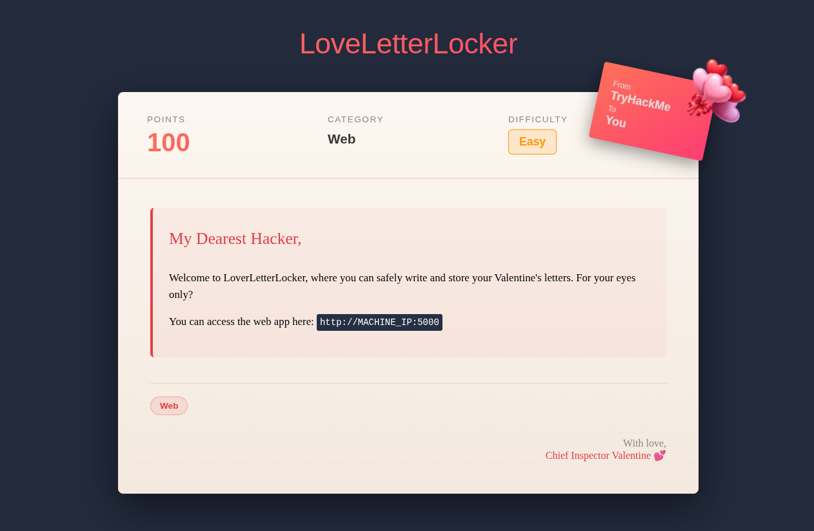
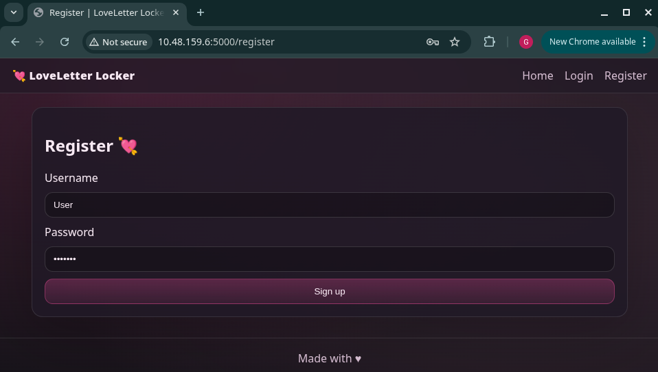
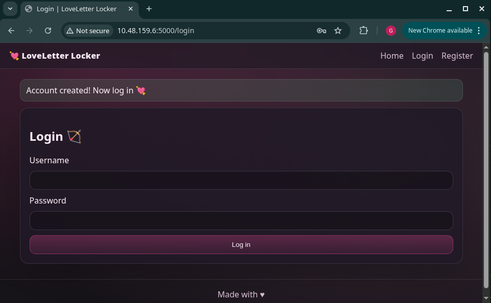
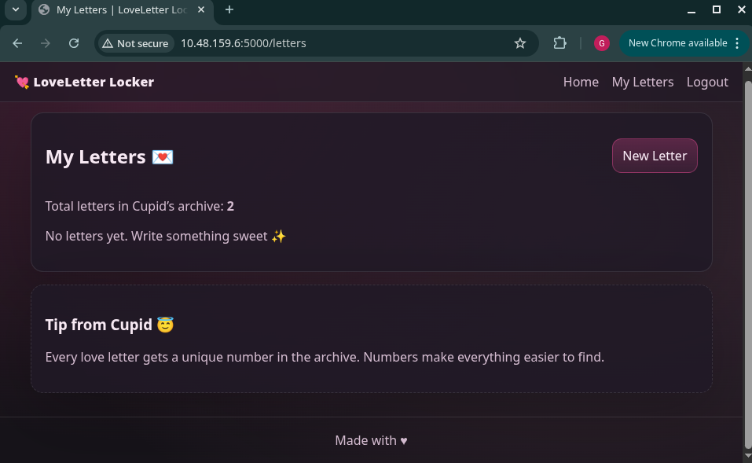
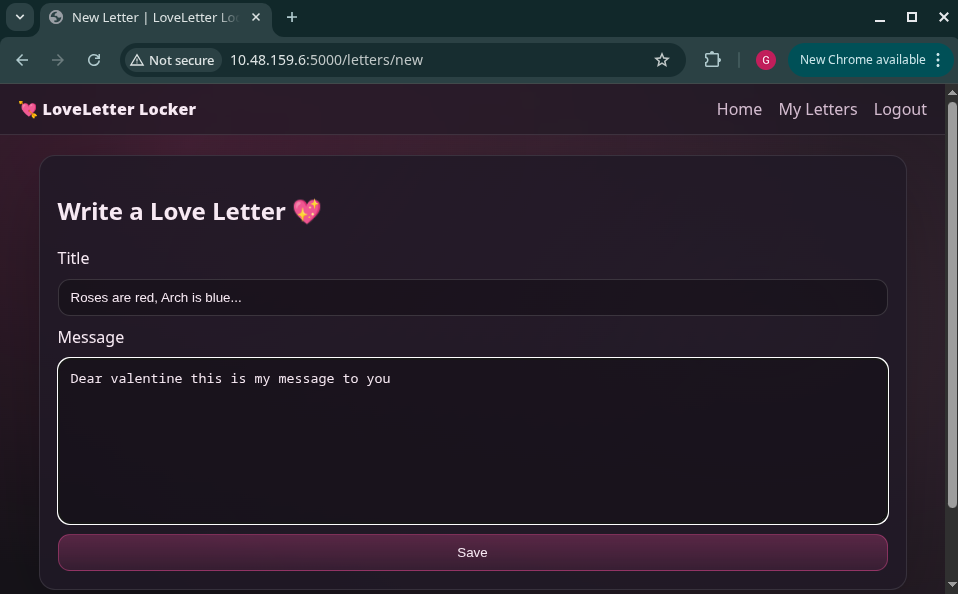
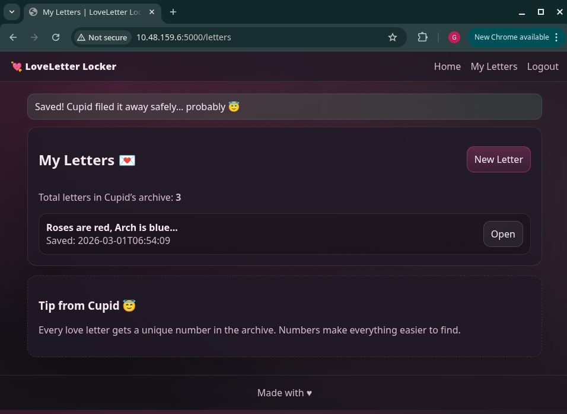

# Love Letter Locker - IDOR Writeup

## Challenge


## Challenge Description:
The challenge introduces LoveLetter, a web application where users can write and store Valentine's letter intended to be private. This suggests a potential access control issue, where improperly protected resources may allow users to read letters belonging to other users.

## Environment Setup

If you are familiar with TryHackMe rooms, you may skip to the **Observation** section.

### Accessing the target
1. Enable the TryHackMe VPN (or use the AttackBox).<br>
2. Start the target machine.<br>
3. Copy the provided target IP address.<br>
4. Open the address in your preferred browser.<br>

## Observation

<br>

To understand how the application works, a test account was created.

<br>

Username used:
```
User
```
Password used:
```
abcd123
```

After signing up, the application redirects to the login page. 
<br>
We'll be using the same username and password we signed up with for the login page
Once login is successful, it should look like this:<br>
<br>

A new letter is created and saved<br>
<br>

Opening the saved letter shows the following page:<br>
<br>

## Identifying the vulnerability
When viewing the letter, the URL contains a numeric identifier (e.g. `/letter/3`). 
This suggests that letters are referenced using sequential IDs.

This is a common indicator of an **Insecure Direct Object Reference (IDOR)** vulnerability, where user-controlled identifiers are used without proper authorization checks.

## Exploitation
To test this, the numeric ID in the URL was manually modified.
<br>
By changing the ID value to `1`, the application returns a letter belonging to another user.

The application does not verify whether the authenticated user owns the requested letter, allowing unauthorized access to other users’ private data.


## Flag:
```
THM{1_c4n_r3ad_4ll_l3tters_w1th_th1s_1d0r}
```
## Conclusion

This challenge demonstrates an IDOR vulnerability caused by missing authorization checks on object references.  
Any authenticated user can access arbitrary letters by modifying the numeric ID in the URL.
